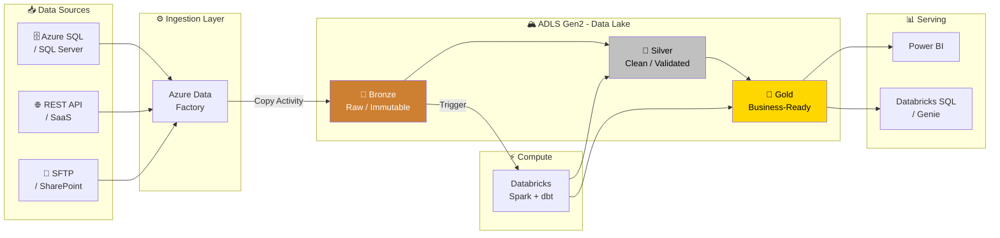
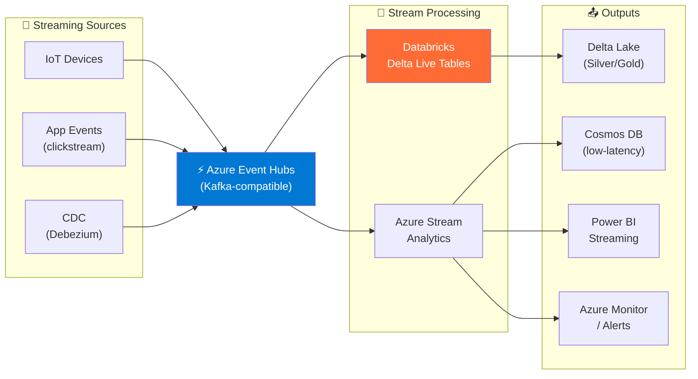
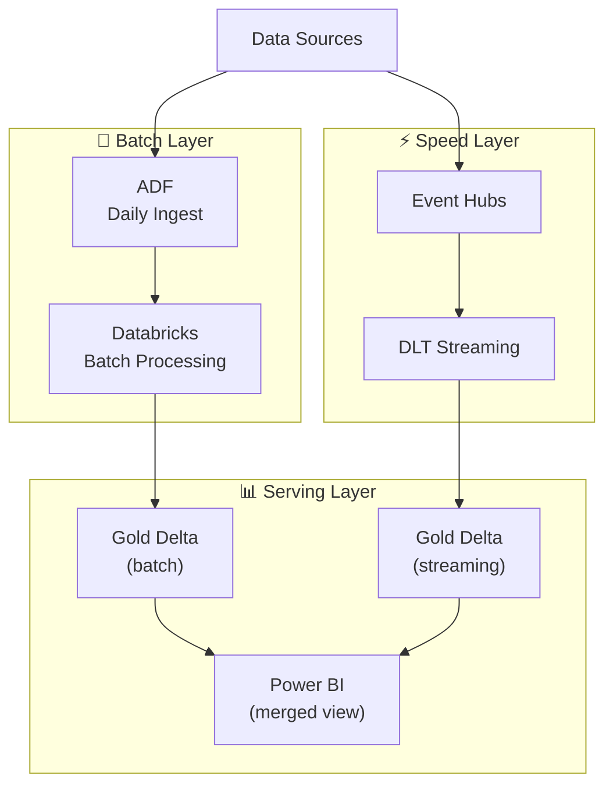
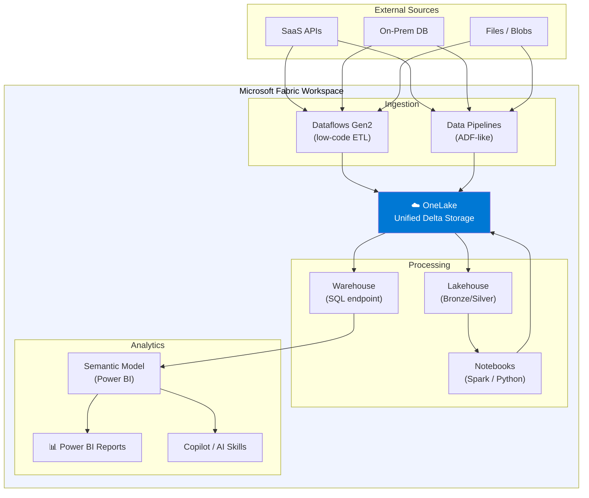
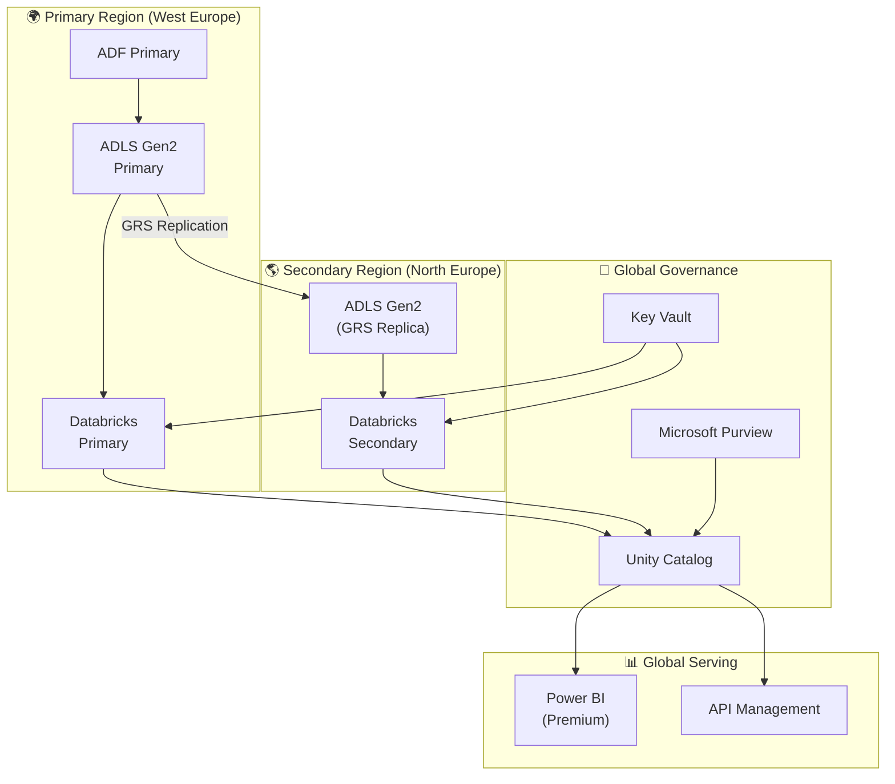
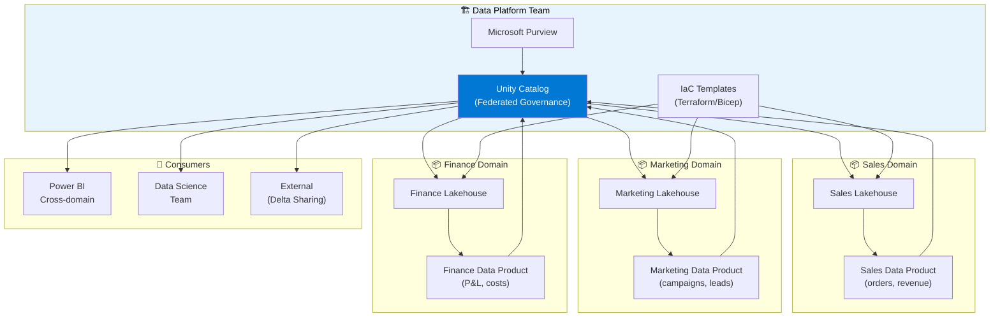

# Diagram Templates - Azure Data Pipelines

## How to Render These Diagrams
- **GitHub** - paste in any .md file, renders automatically
- **VS Code** - install "Markdown Preview Mermaid Support" extension
- **Notion** - /mermaid block
- **Mermaid Live** - https://mermaid.live (paste and share)
- **draw.io** - import Mermaid via Extras → Edit Diagram

---

## Template 1: Classic Batch Pipeline (ADF + Databricks)



---

## Template 2: Real-Time Streaming Pipeline



---

## Template 3: Lambda Architecture (Batch + Speed)



---

## Template 4: Microsoft Fabric End-to-End



---

## Template 5: Multi-Region / HA Architecture



---

## Template 6: Data Mesh Architecture



---

## ASCII Fallback (for WhatsApp / plain text)

```
┌─────────────────────────────────────────────────────────────┐
│                    AZURE DATA PIPELINE                       │
├───────────┬──────────────┬───────────────┬──────────────────┤
│  SOURCES  │  INGESTION   │   DATA LAKE   │    SERVING       │
│           │              │               │                  │
│ SQL Server│              │  🥉 BRONZE    │                  │
│ REST APIs ├─► ADF ───────►  Raw Data    │                  │
│ Files     │              │               │  Power BI        │
│           │  Event Hubs  │  🥈 SILVER   │  Databricks SQL  │
│ IoT/Apps  ├─────────────►  Cleaned      │  API Layer       │
│           │              │               │                  │
│           │  Databricks  │  🥇 GOLD     │                  │
│           │  (Spark/dbt) │  Aggregated  │                  │
└───────────┴──────────────┴───────────────┴──────────────────┘
                Unity Catalog (Governance) across all layers
```
